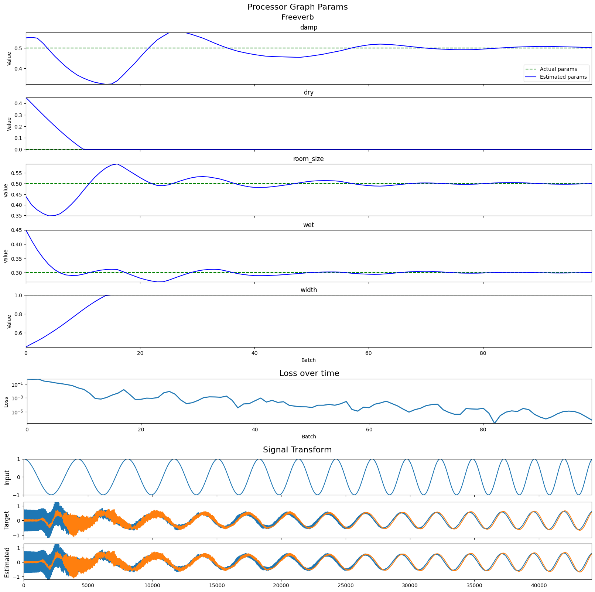
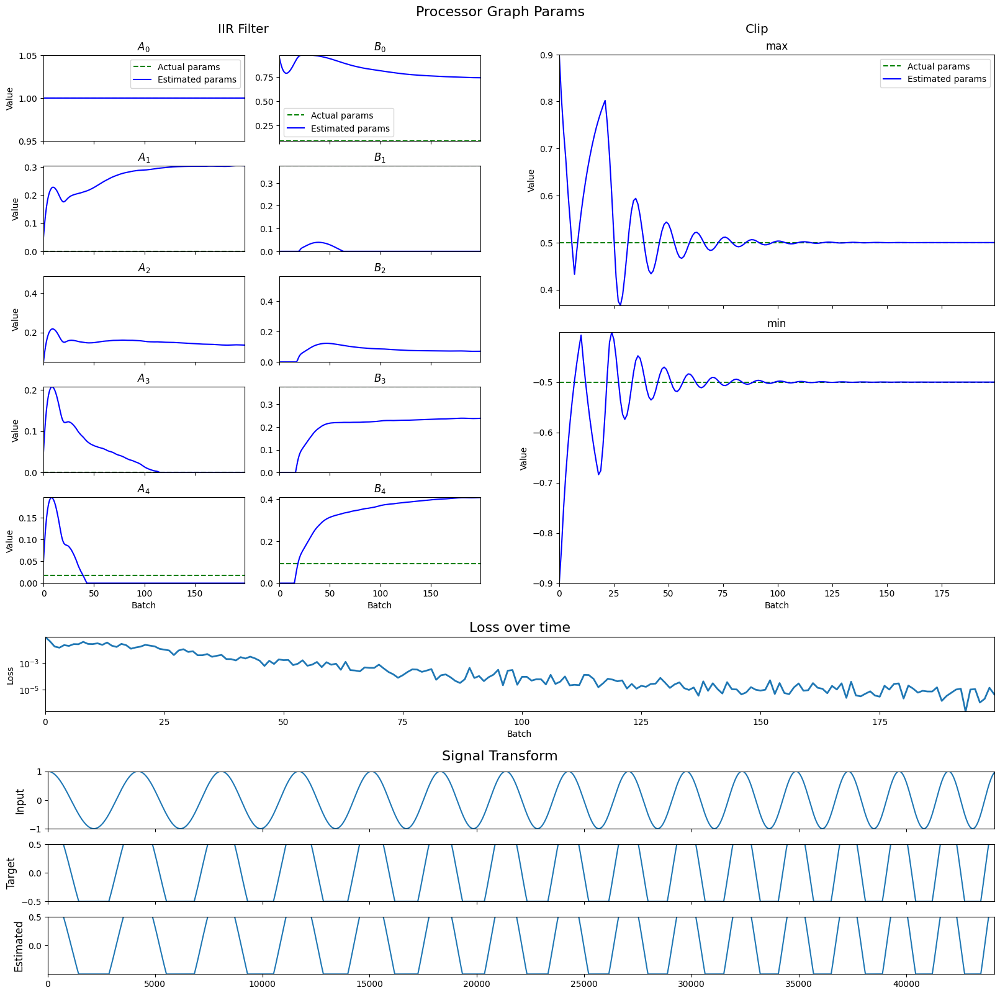

# JAXdsp

Fast, differentiable audio processors on the CPU or GPU, controlled from the browser.

**I'm still working on improvements and an interactive browser client, after which I'll write up a blog post.
In the meantime, the `docs` directory has several Jupyter notebooks with plenty of examples.
The `Differentiable Audio Processors` notebook shows many real DSP examples, along with loss/parameter time-series.**
_(All files under `docs/scratch` are working notes, and can be ignored.)_

The goal of this project is to parameterize audio graphs, in real-time, to produce an audio stream resembling incoming audio.

Built with [JAX](https://github.com/google/jax), WebRTC, WebSockets, and React.
[`react-three-fiber`](https://github.com/pmndrs/react-three-fiber) provides the WebGL backbone for
performant real-time clientside monitoring of the system.




## Server

### Docker server

To build and run the server in a Linux container:

```shell
$ docker build . -t jaxdsp_server
$ docker run -p 8080:8080 -p 8765:8765 --platform linux/amd64 --init jaxdsp_server
```

### Local server

See the [server README](server/README.md) for instructions on running locally.

## Client

```shell
$ cd client
$ npm ci
$ npm run build # or, for a development build: `build:dev`
```

## App

```shell
$ cd app
$ npm ci
$ npm start
```
